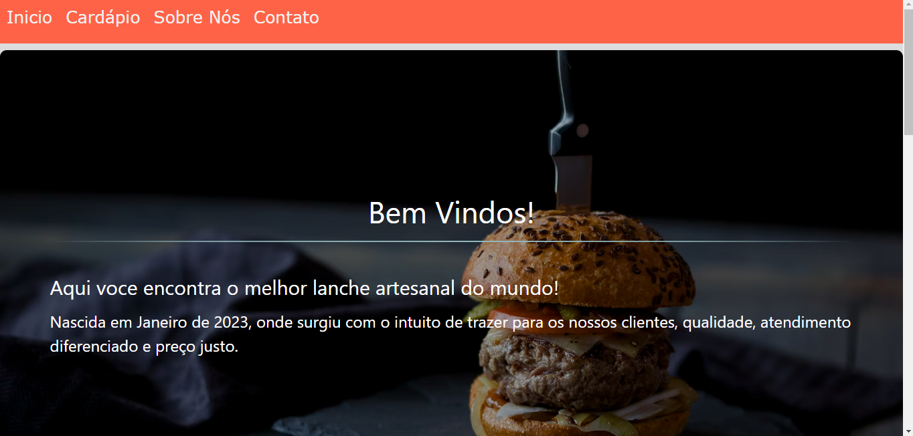
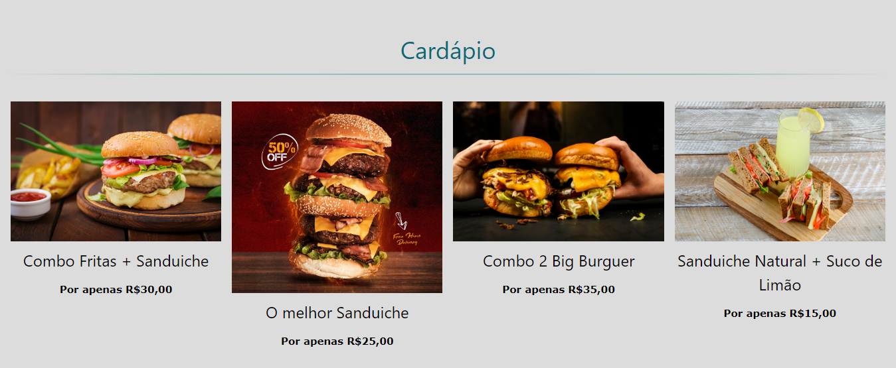

# Landing Page
 - Sistema Web de Lanchonete, para desenvolvê-la foram utilizadas as tecnologias e ferramentas:
     - Html
     - Css
     - JavaScript
     - Visual Studio Code
  
## Deploy
- O site foi hospedado no Netlify, onde o mesmo é uma empresa de computação em nuvem remota que oferece uma plataforma de desenvolvimento que inclui serviços de criação, implantação e back-end sem servidor para aplicativos da Web e sites dinâmicos, com a possibilidade de hospedagem gratuita.
 
    https://larissa-antunes.netlify.app
 

##  Front-End

